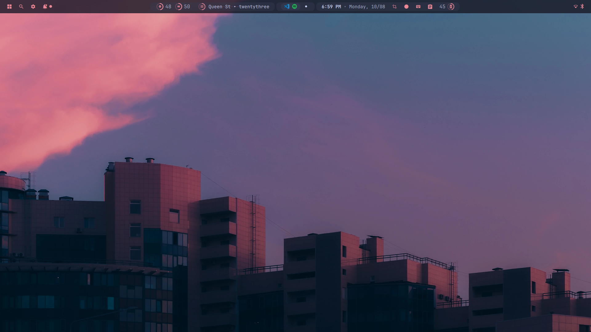
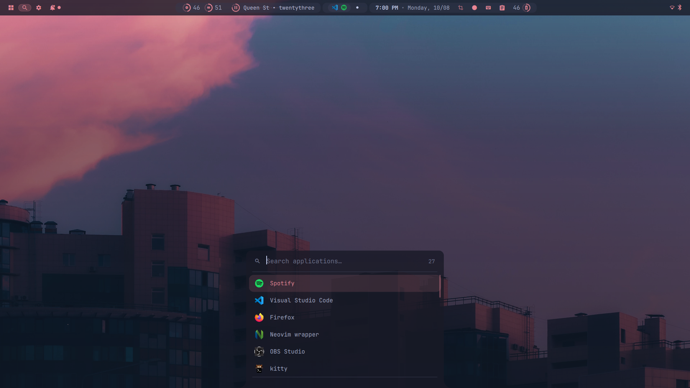
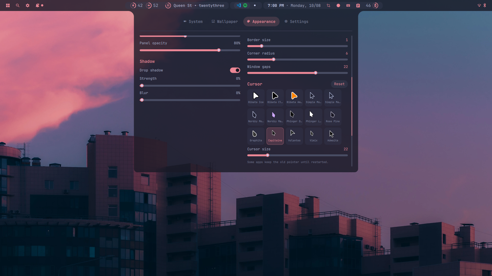
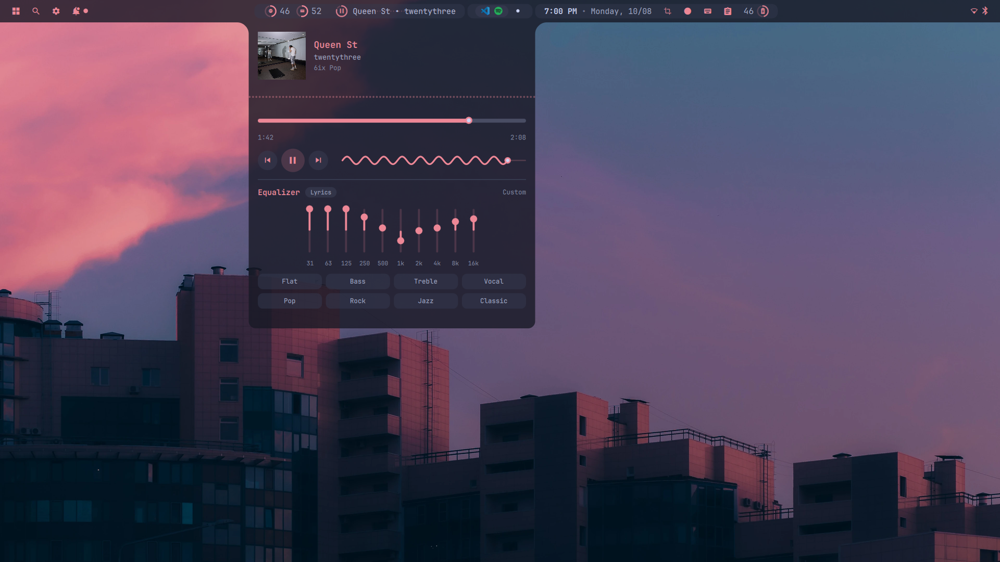

<div align="center">

# dotfiles

**NixOS · niri · a Quickshell desktop shell written from scratch**

Catppuccin across the whole system, driven from one settings panel.

</div>



---

## What this is

A scrolling-compositor desktop built around a custom shell — not a Waybar config
with extra CSS. The bar, launcher, dashboard, notification toasts, OSD, clipboard
manager and media player are ~15,000 lines of QML across 90 files, talking to niri
over IPC and to the system over MPRIS, D-Bus, PipeWire and cliphist.

The part worth stealing is the theming. Pick an accent in the Appearance tab and it
reaches the bar, the window borders, the terminal, the lock screen, GTK apps, the
cursor and Spotify — live, no restarts, no reload script.

| | |
|---|---|
| **OS** | NixOS 26.05 (Yarara) |
| **Compositor** | [niri](https://github.com/YaLTeR/niri) 26.04 — scrolling, not tiling |
| **Shell** | [Quickshell](https://quickshell.org) 0.3.0 (QML / Qt 6.11) — written from scratch |
| **Terminal** | kitty + fish + starship |
| **Editor** | Neovim 0.12, lazy.nvim, 12 plugins |
| **Wallpaper** | awww, two surfaces (sharp behind windows, blurred in overview) |
| **Font** | JetBrainsMono Nerd Font |
| **Palette** | Catppuccin — 4 flavours × 16 accents |

---

## Screenshots

### Launcher — `Mod+D`

Fuzzy app search with recents. Reads `.desktop` entries with correct XDG
precedence, so a user override in `~/.local/share/applications` actually wins.



### Dashboard — `Mod+A`

Four tabs (System, Wallpaper, Appearance, Settings). Every control writes straight
through to a JSON file and re-lays out the bar as you drag. Below: the cursor
picker, which curates ~200 installed theme directories down to 15 and renders its
own previews with `xcur2png`.



### Media — `Mod+P`

MPRIS player with album art, a seekable scrubber, a live cava visualiser, a
10-band PipeWire equalizer with presets, and a lyrics pane that swaps with the
equalizer.



---

## The shell

Lives in [`config/quickshell`](config/quickshell) — 90 QML files, 26 services.

**Bar.** Left cluster (launcher, search, settings, notifications) · CPU and memory ·
media pill with a scrolling marquee · workspace capsules with app icons · clock ·
screenshot · screen recorder · keyboard layout · clipboard · battery · network.

**Dropdown panels.** Calendar, network (with a WiFi password prompt), Bluetooth,
battery detail, clipboard history with image thumbnails, notification centre.

**Services.** 26 singletons — among them `Cava` (audio bands), `Cliphist`,
`Eq` (PipeWire filter-chain), `Lyrics` (LRCLIB), `NightLight`, `Recorder`,
`SysMon`, `Wallpapers`, `Todos`, `Keybinds` (edits niri's binds from the GUI),
and one theming service per target.

**IPC.** The bar exposes a handler niri binds to directly:

```sh
qs ipc call bar toggle launcher|media|network|clipboard|calendar
qs ipc call bar tab    system|wallpaper|appearance|settings
```

---

## Theming

One accent change fans out to every one of these:

| Target | How |
|---|---|
| Bar and panels | `Theme.qml`, reactive — no reload |
| niri borders, focus ring, gaps, corner radius | rewrites `config.kdl` in place; niri hot-reloads |
| kitty | generated `colors.conf` |
| swaylock | generated config, read fresh at each lock |
| GTK 3/4 | `settings.ini` + `gsettings`, live over dconf |
| Cursor | `~/.icons/default`, `gsettings`, and niri's `cursor` block |
| Spotify | spicetify `text` theme, pushed into the running client over CDP |

Two rules the code sticks to. **`config.kdl` has exactly one writer** — a second
service racing it is how hand-edited lines get clobbered, so the cursor picker asks
`NiriTheme` to do the write rather than doing it itself. And **generated files are
never tracked** — every one carries a `do not edit` header and is listed in
`.gitignore`, so moving a slider doesn't dirty the tree.

Spotify's live path is worth a note: `spotify-theme --live` pushes 25 CSS
variables over the Chrome DevTools Protocol via a hand-rolled stdlib WebSocket
client, so the theme follows the slider in well under a second without restarting
the client.

---

## Keybinds

`Mod` is <kbd>Super</kbd>. Full list in [`config/niri/config.kdl`](config/niri/config.kdl);
`Mod+Shift+/` shows niri's own overlay.

### Shell

| Key | Action |
|---|---|
| <kbd>Mod</kbd>+<kbd>D</kbd> | Launcher |
| <kbd>Mod</kbd>+<kbd>A</kbd> | Dashboard — Appearance |
| <kbd>Mod</kbd>+<kbd>Shift</kbd>+<kbd>1..4</kbd> | Dashboard — System / Wallpaper / Appearance / Settings |
| <kbd>Mod</kbd>+<kbd>P</kbd> | Media player |
| <kbd>Mod</kbd>+<kbd>N</kbd> | Network |
| <kbd>Mod</kbd>+<kbd>Y</kbd> | Clipboard history |
| <kbd>Mod</kbd>+<kbd>T</kbd> | Calendar |
| <kbd>Mod</kbd>+<kbd>Tab</kbd> | Overview |

### Apps

| Key | Action |
|---|---|
| <kbd>Mod</kbd>+<kbd>Return</kbd> | kitty |
| <kbd>Mod</kbd>+<kbd>E</kbd> | yazi |
| <kbd>Mod</kbd>+<kbd>G</kbd> | GIMP |
| <kbd>Mod</kbd>+<kbd>Z</kbd> | Colour picker |
| <kbd>Ctrl</kbd>+<kbd>Shift</kbd>+<kbd>S</kbd> | Mullvad |

### Windows and columns

| Key | Action |
|---|---|
| <kbd>Mod</kbd>+<kbd>Q</kbd> | Close |
| <kbd>Mod</kbd>+<kbd>H</kbd> <kbd>J</kbd> <kbd>K</kbd> <kbd>L</kbd> | Focus (arrows work too) |
| <kbd>Mod</kbd>+<kbd>Shift</kbd>+<kbd>HJKL</kbd> | Move |
| <kbd>Mod</kbd>+<kbd>[</kbd> / <kbd>]</kbd> | Consume or expel window |
| <kbd>Mod</kbd>+<kbd>,</kbd> / <kbd>.</kbd> | Consume into / expel from column |
| <kbd>Mod</kbd>+<kbd>R</kbd> | Cycle preset column width |
| <kbd>Mod</kbd>+<kbd>-</kbd> / <kbd>=</kbd> | Width ∓10% |
| <kbd>Mod</kbd>+<kbd>F</kbd> | Maximise column |
| <kbd>Mod</kbd>+<kbd>Shift</kbd>+<kbd>F</kbd> | Fullscreen |
| <kbd>Mod</kbd>+<kbd>C</kbd> | Centre column |
| <kbd>Mod</kbd>+<kbd>V</kbd> | Float |
| <kbd>Mod</kbd>+<kbd>W</kbd> | Tabbed column |

### Workspaces and monitors

| Key | Action |
|---|---|
| <kbd>Mod</kbd>+<kbd>1..9</kbd> | Focus workspace |
| <kbd>Mod</kbd>+<kbd>Ctrl</kbd>+<kbd>1..9</kbd> | Move column to workspace |
| <kbd>Mod</kbd>+<kbd>U</kbd> / <kbd>I</kbd> | Workspace down / up |
| <kbd>Mod</kbd>+<kbd>Scroll</kbd> | Switch workspace |
| <kbd>Mod</kbd>+<kbd>Ctrl</kbd>+<kbd>HJKL</kbd> | Focus monitor |
| <kbd>Mod</kbd>+<kbd>Shift</kbd>+<kbd>Ctrl</kbd>+<kbd>HJKL</kbd> | Move column to monitor |

### Session

| Key | Action |
|---|---|
| <kbd>Mod</kbd>+<kbd>Shift</kbd>+<kbd>S</kbd> | Screenshot region |
| <kbd>Print</kbd> | Screenshot screen |
| <kbd>Mod</kbd>+<kbd>Shift</kbd>+<kbd>P</kbd> | Power off monitors |
| <kbd>Mod</kbd>+<kbd>Escape</kbd> | Inhibit shortcuts |
| <kbd>Mod</kbd>+<kbd>Shift</kbd>+<kbd>E</kbd> | Quit niri |

Media, volume, brightness and mic-mute keys all work, and stay live while locked.

---

## Layout

The tree mirrors where things actually live, so the mapping is obvious:

```
install.sh      links the whole thing into place
nixos/          configuration.nix + hardware-configuration.nix   -> /etc/nixos
config/         everything under ~/.config
  quickshell/     the shell — surfaces, widgets, components, services, scripts
  niri/           config.kdl, wallpaper startup
  nvim/           init.lua, lua/{options,keymaps,plugins,lsp}.lua, lazy-lock.json
  kitty/ fish/ yazi/ cava/ btop/ wlogout/ mako/ fastfetch/ starship.toml
  glow/ Thunar/ obs-studio/ mimeapps.list
  vscode/         settings.json, keybindings.json, snippets -> Code/User/
local/
  bin/            spotify-sync, spotify-theme, spotify-cdp,      -> ~/.local/bin
                  volume, minecraft
  share/          desktop entries that override the packaged ones
    applications/                                                -> ~/.local/share/applications
assets/         screenshots
```

Everything is symlinked, so edits land straight in the repo:

```sh
git clone git@github.com:tomoyo-cpp/quickshell.git ~/dotfiles
cd ~/dotfiles && ./install.sh          # --dry-run to preview
```

`install.sh` is idempotent — a correct symlink is left alone, and anything real
in the way is moved to `<path>.backup-<timestamp>` rather than deleted. The
NixOS link needs root, so it prints the two commands instead of running them.

---

## Notes if you're borrowing this

- **`hardware-configuration.nix` is mine.** Regenerate yours with
  `nixos-generate-config` before rebuilding.
- **Spotify needs `spotify-sync` first.** spicetify can't patch the read-only
  nixpkgs build, so the script builds a writable copy (~103 MB, symlinking
  everything but `Apps/`) and repoints the wrapper at it.
- **Mason won't work.** It fetches dynamically linked binaries; language servers
  come from `configuration.nix` instead, wired up with `vim.lsp.enable`.
- **Generated files are absent by design** — kitty colours, GTK `settings.ini`,
  the swaylock config. They appear the first time the shell runs. `gtk-3.0/`,
  `gtk-4.0/` and `swaylock/` aren't symlinked at all: their writers use atomic
  writes, which replace a symlink with a regular file.
- **`~/.gitconfig` is not here.** It only holds a name and email, and those are
  yours to set.
- **OBS is tracked except its websocket config**, which stores a server password
  in plain text.
- **The volume keys go through [`local/bin/volume`](local/bin/volume), not
  `wpctl` directly.** The equalizer in `configuration.nix` is a filter-chain
  sink, and making it the default puts two volume stages in series — what you
  hear is the filter's level times the real device's. Moving only the first
  leaves the second as a ceiling you cannot see: a Bluetooth headset that
  reconnected at 62% capped output there however far the keys were pushed. The
  script pins every non-default sink to unity so one stage decides the level.
  Copy the equalizer without it and you inherit the bug.
- The wallpaper path is hardcoded in
  [`config/niri/start-awww.sh`](config/niri/start-awww.sh).
